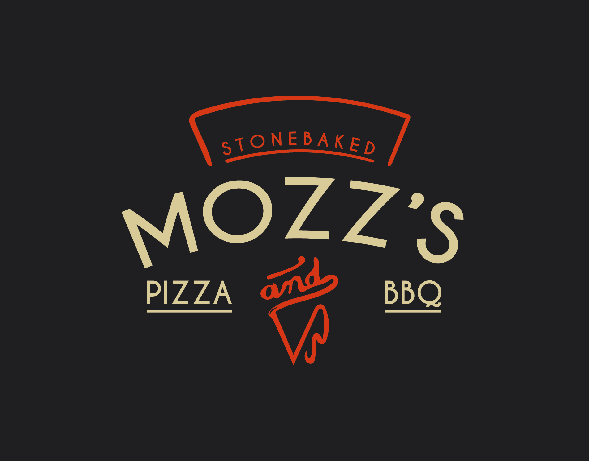
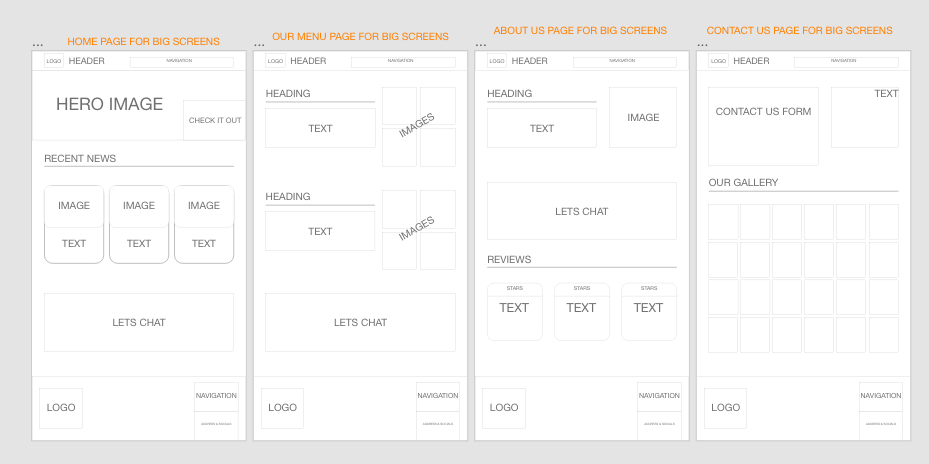
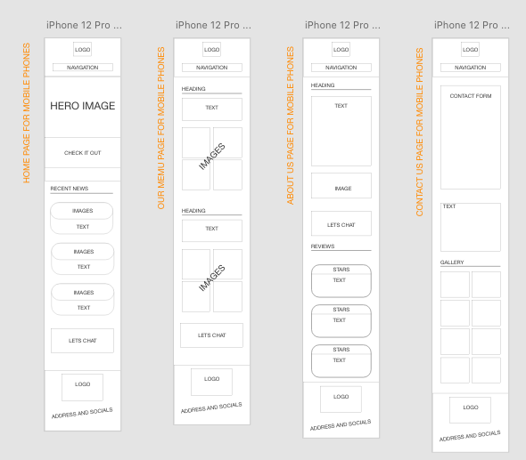

# Mozz's Pizza & BBQ

## Introduction
This website presents Mozz's Pizza and BBQ, a catering company. Users will be people looking for a caterer for a private or public event and they will be able to find interesting content in a simple and easy way.

The main aim of this project was to produce a reponsive easy to use website, by only using HTML and CSS.

I got inspiration for this project off one of my current jobs at https://www.acebars.co.uk/ my boss always said he would love to rebrand so I thought that I would give it a go.

## Table of contents
* [Website owner business goals](#Website-owner-business-goals)
* [User goals](#User-goals)
* [Features](#Features)
* [Technology](#Technology)
* [Testing](#Testing)
* [Deployment](#Deployment)
* [Credits](#Credits)
* [Screenshots](#Screenshots)
* [The future of the site](#Future)

# Website owner business goals
The main reason that this website exists is to help a small catering company present itself to the public. The page owner can present recent news, reviews and a gallery of different foods and events, with an easy way for the potential clients to enquire about hiring them out.
# User goals
## All user goals
- User is able to easily navigate through the site.
- User is able to find information out easily.
- User can find the location of the contact details.
# Features
## Clean structure
The website is designed to give the user a great experience and to be user-friendly on all types of devices. There will be no difference in the experience users have when on a mobile compared to a laptop!

### Wireframes
I used Adobe XD to create my wireframes.
#### Wireframe for big screens

#### Wireframe for mobile screens

# Technology
# Testing
# Deployment
# Credits
# Screenshots
# The future of the site

