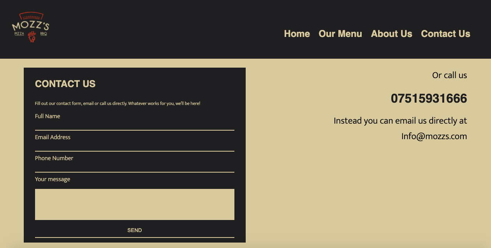

# Mozz's Pizza & BBQ

## Introduction
This website presents Mozz's Pizza and BBQ, a catering company. Users will be people looking for a caterer for a private or public event and they will be able to find interesting content in a simple and easy way.

The main aim of this project was to produce a reponsive easy to use website, by only using HTML and CSS.

I got inspiration for this project off one of my current jobs at https://www.acebars.co.uk/ my boss always said he would love to rebrand so I thought that I would give it a go.

## Table of contents
* [Website owner business goals](#Website-owner-business-goals)
* [User goals](#User-goals)
* [Features](#Features)
* [Technology](#Technology)
* [Testing](#Testing)
* [Deployment](#Deployment)
* [Credits](#Credits)
* [Screenshots](#Screenshots)
* [The future of the site](#Future)

# User goals
## All user goals
- User is able to easily navigate through the site.
- User is able to find information out easily.
- User can find the location of the contact details.
## Returning user goals
- User is able to easily find new menu's, images and news reports.
- User can send a message to the company using a contact form.
- Can learn more about the company
## Website owner business goals
- To help a small catering company present itself to the public.
- Have a great SEO website to help find new clients and fans.
- Have an easy way for new or existing clients to contact them.

# Features
## Clean structure
The website is designed to give the user a great experience and to be user-friendly on all types of devices. There will be no difference in the experience users have when on a mobile compared to a laptop!

### Wireframes
I used Adobe XD to create my wireframes.
#### Wireframe for big screens

#### Wireframe for mobile screens

### Site styles

#### Colours
* Background Colour - #D8CB97
* Secondry Colour - #1F1E20
* Main Typeface Colour - #1F1E20
* Secondry Typeface Colour - #D8CB97

#### Fonts
* For my fonts I used 'Mukta', with a backup off sans-serif.

#### Images 

* For my images I used [Unsplash.com](https://unsplash.com) and they are credited in [credits](#credits) section.

* I also used my own images, As this website is dedicated to one of my current jobs I have taken my own pictures when at events.
 
[Back to Table of contents](#table-of-contents)

## Features of the Website
The website consists of 8 pages. Four are accessible from a navigation menu. Three are news pages and one is a submission confirmation page for the contact form.

## Navigation bar
* Navigation bar is visable on the top of each page, it is responsive to screen size and will adapt when the size changes.

#### Navigation scheme:
- On the left side there is the logo, which also can be used as a navigation link to the index page.
- On the right side there are 4 links, which are:
    - Home
    - Our Menu
    - About us
    - Contact us

#### Footer:
- The footer, on big and medium sized screens are the same, with the logo on the left and navigation links to the main site pages, underneath is the address and phone number, social media links and copyright section.
- The footer, on smaller screens has the logo in the middle with just the address, contact number, social links and the copyright section.

#### Home
* ##### Hero Image
- This section holds the hero image that covers the whole section.
- It also has an overlapping div which gives visiters the chance to go straight to our menu page.
* ##### Recent News
- This section shows 3 cards about the recent news of the company.
- On big and medium screens. The cards are stacked in a row, each card has an image on top and a bit of information on the bottom.
- On mobile screens the 3 cards are stacked on top of each other in a row. The card is layed out differently too with the image on the left and the text on the right.
- All cards have a hover effect which adds shaddow to it, giving it the effect it's lifted above the rest.
- All cards are links to seperate pages that are unreachable on the main nav bar. 
* ##### Contact us
- The contact us section is seen on all pages other than the "Contact-us" page.
- It is a small section which gives the visiter the chance to jump straight to the contact us section. 

#### Our Menu
* ##### Menu Sections
- Both menu sections are the same, they contain a header and text on the left and 4 images on the right, however when the screen switches to mobile the header and text is centered to the middle and the images are underneath.
* ##### Contact us
- The contact us section is seen on all pages other than the "Contact-us" page.
- It is a small section which gives the visiter the chance to jump straight to the contact us section. 

#### About Us
* ##### Company Info
- The company info includes a couple of paragraphs giving the visiter information about who we are, who the owner is and where we have come from.
- On big and medium screens there is an image on the right, when the view moves to a smaller screen the images is layed out underneath the text.
* ##### Contact us
- The contact us section is seen on all pages other than the "Contact-us" page.
- It is a small section which gives the visiter the chance to jump straight to the contact us section. 
* ##### Reviews
- The review section has the small cards displaying our most recent reviews.
- Each card has stars at the top that the customer has given to us, and the review that they have given to us beneath it.
- Like the recent news section the cards are stacked in a row on big/medium screen sizes then switches to collums on smaller screen sizes.
- It also has the same hover effect as the recent news section, with a shaddow being added on hover, giving it the effect that it lifts off the page.
* ##### Gallery
- The gallery has lots off diferent images in it, to show the different range in events that we offer.
- On big screens the collumn count is 6, on medium screens it is 3 and on smaller screens it is 2.

#### Contact Us
* ##### Contact us secttion
- This section holds 2 ellements a contact form and a text section.
- The contact form has the secondry colour as it's background and takes up 60% of the screen. Our visiters are able to easily contact us by filling out the form and adding a message of what they want from us.
- The text ellement has useful information on how our customers can contact us if they don't want to use the contact form.
- On big and medium screens the elements are shown in a row with the contact form on the left. Then on small screens the elements are shown in a collumn with the contact form on top.

 
[Back to Table of contents](#table-of-contents)

# Technology
### HTML5
* As a structure language.
### CSS
* As a style language
### Font Awesome
* As an icon library for social links.
### Google Fonts
* As a font resource.
### GitHub
* As a software hosting platform to keep the project in a remote location.
### Git 
* As a version-control system tracking.
### Gitpod
* As a development hosting platform.
### Adobe XD
* As a wireframing tool.
### Adobe Photoshop
* As an image editor.
 
[Back to Table of contents](#table-of-contents)

# Testing
## Functionality Testing
I used Mozilla web developer tools and Chrome developer tools throughout the project for testing and solving problems with responsiveness and style issues.

## Compatibility Testing
The website was tested across multiple virtual mobile devices and browsers. I checked all supported devices in both web developer tools.

I tested on hardware devices such as: Apple Ipad 12 pro, Samsung S20 Ultra smartphone with Android 10 and used a Iphone 5 to compare the diference in size.

## User Stories Testing
### As a buisness owner:
- To help a small catering company present itself to the public.
    > Images of events, information about the company and a news section to help the public understand who we are.
- Have a great SEO website to help find new clients and fans.
    > With great SEO we will be at the top of most search engines which will help us get more support and clients.
- Have an easy way for new or existing clients to contact us.
    > A very simple and easy way for new and existing clients to contact us.
### As a new customer
- User is able to easily navigate through the site.
    > User is able to find the navigation very easily on any screen size.
- User is able to find information out easily.
    > User can find any information out very easily by clicking on the about us page, which is on the navigation.
- User can find the location of the contact details.
    >  User can find all the details on the contact us page, as well as on the footer
### As a returning customer
- User is able to easily find new menu's, images and news 
reports.
   > User can find the menu, images and news reports all from the home page.
- User can send a message to the company using a contact form.
    > User can find a contact form in contact page. Alternatively can use an email or phone number. Email address and phone number are both located in the footer the bottom of each page, as well as on the contact page.
- Can learn more about the company.
    > User is able to find any information out easily, they can also access our social media from the links in the footer. Futhermore, they can easily contact us for any other information they need to find out.

___
## Issues Found During Site Development
- Horizontal scrolling bar on the bottom of the screen.

The horizontal scrolling bar is only visable on the home page, so I new there was an element on that page that wasn't working properly. 

I used the [Unicorn Revealer](https://chrome.google.com/webstore/detail/unicorn-revealer/lmlkphhdlngaicolpmaakfmhplagoaln?hl=en-GB) extension to chrome browser which was very helpful. It helped me understand that my issue was within my hero image. I found that my section with ID hero-outer had a width of 120% instead of 100%.

- Issues with margin & padding as the screens get smaller.

I noticed that as the screen sizes got smaller the margin on the contact page wasnt working for some reason. I fixed the issue by giving the section with ID contact a position of relative and an element top of 150px.
## Performance Testing
I used [Lighthouse](https://developers.google.com/web/tools/lighthouse/) tool to check performance of the website. I had to make a few changes that I needed to make to improve the scores. Screenshots and supporting text is presented below:

Initial screenshot

## Code Validation
At the end of the project I used 2 websites to validate the code.
 * [W3C CSS Validator](https://jigsaw.w3.org/css-validator/) to validate CSS
 * [Nu Html Checker](https://validator.w3.org/) to test HTML
 All code passed with no errors or warnings.
 
[Back to Table of contents](#table-of-contents)

# Deployment
The project was deployed on GitHub Pages. I used Gitpod as a development environment where I commited all changes to git version control system. I used push command in Gitpod to save changes into GitHub.

To deploy a project I had to:

* Log in to GitHub and click on repository to deploy ([Portfolio-Project-1](https://github.com/Jonnywdev/Portfolio-Project-1))
* Select `Settings` and find the Pages section at the second to bottom of the page's navigation menu on the left hand side of the screen. 
* From source select branch `main` and then the `root` folder.
* Click `save` and page was deployed after auto-refresh.
>  Your site is published at https://jonnywdev.github.io/Portfolio-Project-1/

To run localy:
* Log in to GitHub and click on repository to download ([Portfolio-Project-1](https://github.com/Jonnywdev/Portfolio-Project-1))
* Select `Code` and click Download the ZIP file.
* After download you can extract the file and use it in your local environment

Alternatively you can [Clone](https://docs.github.com/en/free-pro-team@latest/github/creating-cloning-and-archiving-repositories/cloning-a-repository)
or [Fork](https://docs.github.com/en/free-pro-team@latest/github/getting-started-with-github/fork-a-repo)
this repository ([Portfolio-Project-1](https://github.com/Jonnywdev/Portfolio-Project-1)) into your github account.

 
[Back to Table of contents](#table-of-contents)

# Credits
* To complete this project I used Code Institute student template: [gitpod full template](https://github.com/Code-Institute-Org/gitpod-full-template)

* Ideas and knowledge library:

    * [w3schools.com](https://www.w3schools.com)

    * [css-tricks.com](https://css-tricks.com/)

    * [stackoverflow.com](https://stackoverflow.com/)
    
    * [codepen.io](https://codepen.io/)

## Code:
* Hero image cover text: [Love Running project](https://learn.codeinstitute.net/courses/course-v1:CodeInstitute+LR101+2021_T1/courseware/4a07c57382724cfda5834497317f24d5/6fd29d155c3b42248ff57bae32978a4b/)

## Images:

### Unsplash.com
* [Gallery-1.jpg](https://unsplash.com/photos/MqT0asuoIcU)
* [Gallery-2.jpg](https://unsplash.com/photos/27TY3Y2kUyU)
* [hero-image.jpg](https://unsplash.com/photos/u6NiMLJftRs)

 
[Back to Table of contents](#table-of-contents)

# Screenshots
## Project Screenshots

 
[Back to Table of contents](#table-of-contents)

# The future of the site

 
[Back to Table of contents](#table-of-contents)

